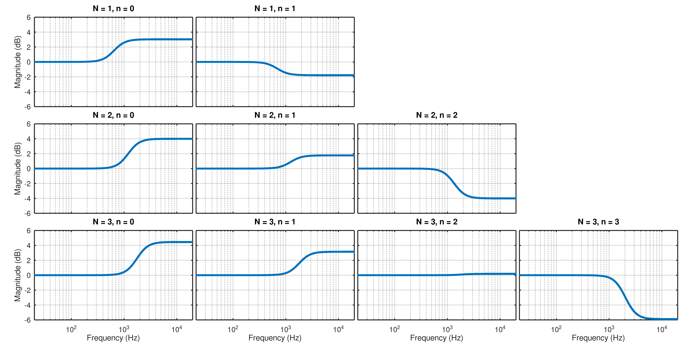

# Ambisonic Psychoacoustic Optimisation

If you are not interested in the theory you can read about how to use `AmbisonicOptimFilters` [here](#ambisonicoptimfilters).

## Theory and Implementation Details

When decoding ambisonic signals to loudspeakers (or binaural using the virtual loudspeaker approach) there is a limit frequency $`f_{\mathrm{lim}}`$ above which the sound field is no longer considered well-reproduced.
This limit frequency increases with the ambisonic order as can be approximated using [[1]](#ref1)

```math
f_{\mathrm{lim}} = \frac{c N}{4 R (N + 1) \sin(\pi/(2N + 2))}
```

where $c$ is the speed of sound in m/s, and $R$ is the radius of the reproduction area in metres.
For a central listener, and assuming $R = 0.09$ m (approximate radius of a human head), the limit frequencies for 1st to 3rd order are approximately 674 Hz, 1270 Hz, and 1867 Hz.

Ambisonic theory optimises for the velocity vector at low frequencies and the energy vector at higher ones.
This optimisation is performed simply by applying a gain by-order to the input signal.
At low frequencies the gain is unity and this is known as a basic decoder.
At higher frequencies it the gains are chosen to psychoacoustically optimised the signal.
This is done such that the energy in the decoded loudspeaker array is concentrated in the source direction.
This is known as max $`\textbf{r}_{\textrm{E}}`$ decoding.

The weights applied to the channels of each set of channels of degree $n$ are

```math
a_{n}^{2D} = \cos\left( \frac{n\pi}{2N + 2} \right)
```

for 2D decoding [[2]](#ref2).
For 3D decoding they can be approximated using [[3]](#ref3)

```math
a_{n}^{3D} = P_{n}\left(\cos \left(\frac{137.9^{\circ}}{N + 1.51}\right) \right)
```

where $P_{n}$ is a Legendre polynomial.
The decoding equation (see [here](AmbisonicDecoding.md)) becomes

```math
\textbf{x}(t) = \textbf{D}_{N}^{\mathrm{SN3D}} \mathrm{diag}(\textbf{a}_N)\textbf{b}_{N}(t)
```

where $`\textbf{a}_N`$ is a vector of length $`(N + 1)^{2}`$ containing the max $`r_{\mathrm{E}}`$ gains with an energy compensation gain applied.
The gains applied to frequencies below the limit frequency are all unity so $`\mathrm{diag}(\textbf{a}_N)`$ is the identity matrix, meaning the above equation collapses back to the original decoding equation.

The frequency-dependent application of these gains leads to a set of shelf filters that are applied to channels of the same order.
The filtered signal can then be decoded using a frequency-independent decoder.

### Shelf Filter Implementation

Psychoacoustic optimisation is implemented in `AmbisonicOptimFilters`.
In order to apply the optimisation gains in a frequency-dependent manner $`\textbf{b}_{N}`$ is filtered by shelf filters with a transition frequency set to the limit frequency, unity gain below and $`a_{n}`$ gain above.

The filters must be phase-matched to ensure correct decoding.
`AmbisonicOptimFilters` uses 4th-order Linkwitz-Riley filters for this purpose.
These are implemented as IIR filters, meaning that the optimisation filtering will have low latency suitable for real-time applications.
Linkwitz-Riley filters have the advantageous property that when a low-passed and high-passed signal are summed the magnitude response is flat.
In practice, `AmbisonicOptimFilters` applies a low- and high-pass filter to the input, multiplies the low-passed signal by $`a_{n}`$ and sums it with the high-passed signal.

The magnitude responses of each of the optimisation filters is shown in the graphs below for orders 1 to 3.



**Note**: `AmbisonicDecoder` and `AmbisonicAllRAD` already use `AmbisonicOptimFilters` internally. Therefore, psychoacoustic optimisation should not be applied before using these decoders.

## AmbisonicOptimFilters

### Configuration

Before calling any other functions the object must first be configured by calling `Configure()` with the appropriate values. If the values are supported then the it will return `true` and the object can now be used.

The configuration parameters are:

- **nOrder**: The ambisonic order from 1 to 3.
- **b3D**: A bool to indicate if the signal is to be filtered is 2D (azimuth only) or 3D (azimuth and elevation).
- **nBlockSize**: The maximum number of samples the object is expected to process at a time.
- **sampleRate**: The sample rate of the audio being used e.g. 44100 Hz, 48000 Hz etc. This must be an integer value greater than zero.

### Set Custom Optimisation Gains

`AmbisonicOptimFilters` defaults to using max $`r_{E}`$ optimisation. However, the user can supply their own optimisation gains to be applied to the high frequency shelf using `SetHighFrequencyGains()`. The number of gains should be equal to $`N + 1`$.

### Apply Optimisation Filters

A B-format signal can be optimised using the `Process()` function. The input signal is replaced by the optimised signal.

The inputs are:

- **pBFSrcDst**: A pointer to the source B-format signal that is replaced with the processed signal.
- **nSamples**: The length of the input signal in samples.

## Example

```c++
#include "Ambisonics.h"

using namespace spaudio;

const unsigned int sampleRate = 48000;
const int nBlockLength = 512;

// Higher ambisonic order means higher spatial resolution and more channels required
const unsigned int nOrder = 1;
// Set the fade time to the length of one block
const float fadeTimeInMilliSec = 1000.f * (float)nBlockLength / (float)sampleRate;

std::vector<float> sinewave(nBlockLength);
// Fill the vector with a sine wave
for (int i = 0; i < nBlockLength; ++i)
    sinewave[i] = (float)std::sin((float)M_PI * 2.f * 440.f * (float)i / (float)sampleRate);

// B-format buffer
BFormat myBFormat;
myBFormat.Configure(nOrder, true, nBlockLength);
myBFormat.Reset();

// Encode the signal to Ambisonics
AmbisonicEncoder myEncoder;
myEncoder.Configure(nOrder, true, sampleRate, 0);
PolarPosition<float> position;
position.azimuth = 0;
position.elevation = 0;
position.distance = 1.f;
myEncoder.SetPosition(position);
myEncoder.Reset();
myEncoder.Process(sinewave.data(), nBlockLength, &myBFormat);

// Set up the optimisation filters
AmbisonicOptimFilters myOptim;
myOptim.Configure(nOrder, true, nBlockLength, sampleRate);

// Filter the Ambisonics signal
myOptim.Process(&myBFormat, nBlockLength);
```

## References

<a name="ref1">[1]</a> Stéphanie Bertet, Jérôme Daniel, Etienne Parizet, and Olivier Warusfel. Investigation on localisation accuracy for first and higher order Ambisonics reproduced sound sources. Acta Acustica united with Acustica, 99(4):642–657, 2013. doi: <http://dx.doi.org/10.3813/AAA.918643>.

<a name="ref2">[2]</a> Jérôme Daniel. Représentation de champs acoustiques, application à la transmission et à la reproduction de scènes sonores complexes dans un contexte multimédia. PhD thesis, University of Paris 6, 2000.

<a name="ref3">[3]</a> Franz Zotter and Matthias Frank. All-round ambisonic panning and decoding. Journal of the Audio Engineering Society, 60(10):807-820, 2012.
