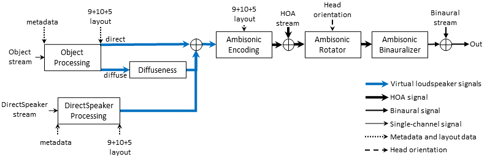

# Rendering To Binaural Using The `Renderer` Class

If you are not interested in the details and just want to get coding, see the [code example](#code-example).

## Introduction

The ADM specification does not have a specific implementation for rendering to binaural. EBU's BEAR [[1]](#ref1) provides a method for rendering an ADM stream to binaural.
However, BEAR requires a  binaural room impulse responses (BRIRs) that would increase the size of `libspatialaudio` by too large a degree.

Therefore, the binaural rendering of `Renderer` is inspired by BEAR in its use of a virtual loudspeaker layout but the final binauralisation is performed differently, in order to remove the requirement for including more HRTFs than those used for `AmbisonicBinaurlization`.

BEAR uses a virtual 9+10+5 loudspeaker layout and then binauralises the loudspeaker signals using BRIRs in the corresponding directions based on the loudspeaker position and the listener head orientation.

`Renderer` uses the same virtual loudspeaker layout for rendering Object and DirectSpeaker signals.
These loudspeaker signals are then converted to Ambisonics by encoding them based on the loudspeaker directions (ignoring listener head rotation).
This encoded signal is then summed with any HOA streams that have been added.
The composite stream is then rotated using `AmbisonicRotator` to apply the listener head rotation.
Finally, any direct binaural signal are added to the output.
The signal flow is shown in the figure below.

### Advantages and Disadvantages Compared to BEAR

The advantages of this method, besides the fact that no new HRTFs need to be added to the library, are that:

- the number of expensive convolution is kept low. BEAR needs 48 convolutions (24 loudspeakers, 2 ears) to be performed, compared to 32 using the described method (16 channels, 2 ear). Furthermore, since BEAR uses BRIR the CPU load of the convolutions is increased compared to using anechoic HRIRs.
- custom HRTFs can be easily loaded using the .SOFA file format.
- in case very low CPU use is required the binaural rendering can use 1st order Ambisonics internally, reducing the number of convolutions to only 8 (or 4 if the symmetric head assumption is used).

The main disadvantage of this method is that the lack of the room in rendered binaural could reduce externalisation when compared to the BRIR method. It has been shown that using a BRIR instead of an anechoic HRIR can improve externalisation.

## Code Example

See the main [Renderer overview](RendererOverview.md#code-example) for a full code example that renderers multiple different stream types to binaural.

## References

<a name="ref1">[1]</a> European Broadcasting Union. EBU Tech 3369: Binaral EBU ADM Renderer (BEAR) for Object-Based Sound Over Headphones, Geneva, Switzerland, 2023. URL <https://tech.ebu.ch/publications/tech3396>.
